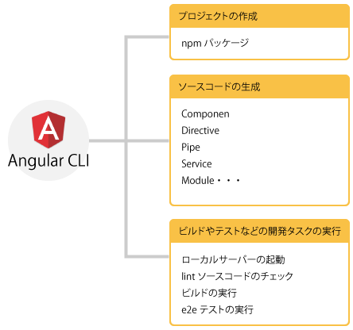
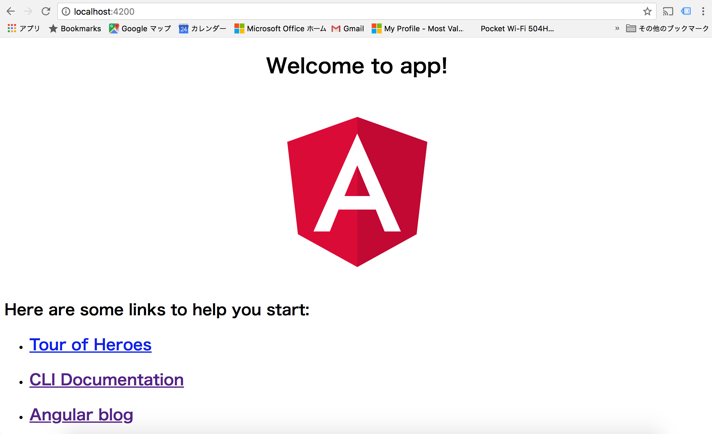
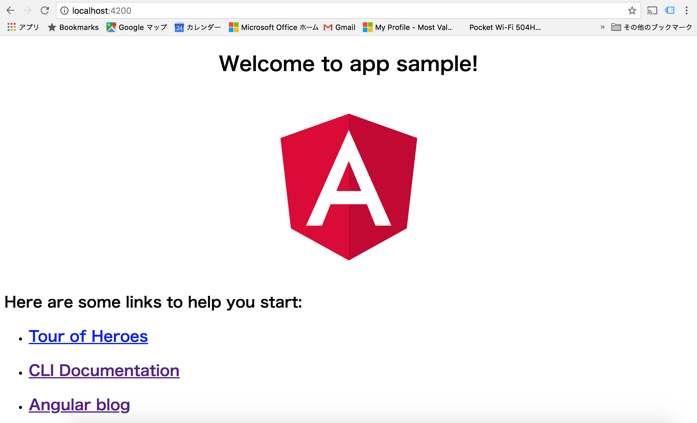

Angular アプリケーションの開発を進める上で最も簡単で効率的なツールは angular-cli を利用することです。 angular-cli は、開発に必要なライブラリをまとめていて、かつ、スカッフォールドも行えます。



## angular-cli のインストール

Node.js のインストールが済んでいれば、次に行うことは angular-cli を[インストールする](https://github.com/angular/angular-cli/blob/master/README.md)ことです。angular-cli は npm\(Node Package Manager\) を使ってインストールします。インストール完了後 `ng help` や `ng version` が実行できていれば無事インストールが完了しています。

> angular-cli のコマンドは ng を使います。ng コマンドには多くの機能が実装されてますので `ng help` で色々と確認すると良いでしょう。

```
$ npm install -g @angular/cli
$ ng version

    _                      _                 ____ _     ___
   / \   _ __   __ _ _   _| | __ _ _ __     / ___| |   |_ _|
  / △ \ | '_ \ / _` | | | | |/ _` | '__|   | |   | |    | |
 / ___ \| | | | (_| | |_| | | (_| | |      | |___| |___ | |
/_/   \_\_| |_|\__, |\__,_|_|\__,_|_|       \____|_____|___|
               |___/
    
Angular CLI: 1.6.8
Node: 8.9.4
OS: darwin x64
Angular: 
...
$ ng help
ng build <options...>
  Builds your app and places it into the output path (dist/ by default).
  aliases: b
  --target (String) (Default: development)
    aliases: -t <value>, -dev (--target=development), -prod (--target=production)
  --environment (String) (Default: )
    aliases: -e <value>
  --output-path (Path) (Default: null)
    aliases: -o <value>
  --watch (Boolean) (Default: false)
    aliases: -w
  --watcher (String)
  --suppress-sizes (Boolean) (Default: false)
  --base-href (String) (Default: null)
    aliases: -bh <value>
  --aot (Boolean) (Default: false)
  --sourcemap (Boolean) (Default: true)
    aliases: -sm
  --vendor-chunk (Boolean) (Default: true)
  --verbose (Boolean) (Default: false)
  --progress (Boolean) (Default: true)

・・・
```

もし既に古いバージョンの angular-cli がインストールされていた場合には更新を行います。

```
$ npm uninstall -g @angular/cli
$ npm cache verify
# if npm version is < 5 the use `npm cache clean`
$ npm install -g @angular/cli@latest
```

尚、Angular CLI 1.0.0-beta.28 より以前のものを利用していた場合には、次のように削除します。

```
$ npm uninstall -g angular-cli
$ npm uninstall --save-dev angular-cli
```

angular-cli で私がよく利用するコマンドは

* ng new
* ng serve
* ng test
* ng e2e 
* ng g

です 。特に開発の初期では ng g はもっとも多く叩くコマンドで（ng g の g は generator の g）テンプレートを生成してくれます。  
angular-cli のコマンドは [github](https://github.com/angular/angular-cli/wiki) に詳細が書かれてますので一読されると良いと思います。

| Scaffold | Used |
| :--- | :--- |
| Component	| ng g component my-new-component	|
| Directive	| ng g directive my-new-directive	|
| Pipe | ng g pipe my-new-pipe |
| Service	| ng g service my-new-service	|
| Class	| ng g class my-new-class	|
| Guard	| ng g guard my-new-guard	|
| Interface	| ng g interface my-new-interface	|
| Enum | ng g enum my-new-enum |
| Module | ng g module my-module |

## angular-cli を使ったプロジェクトの生成

プロジェクトの生成には `ng new` を使います。このコマンドは必要なファイルを生成し、npm インストールを実行します。ここでは Hands-onプロジェクトを作成します。まずは cd ~ でホームディレクトリに移動しプロジェクトの生成を行います。

> 私はホームディレクトリ\(cd ~\) の直下に Sandbox というディレクトリを作って、そこでプロジェクト開発をしています。

```
$ cd ~
$ ng new CliSample1
$ cd CliSample1
$ ng serve
```

実際にプロジェクトを生成します。プロジェクトの作成には（ネットワークの状況にもよりますが）若干の時間を要します。下記のような`Installing packages for tooling via yarn.` というメッセージから中々応答が帰ってこないこともありますが辛抱強く待ちましょう。

```
$ ng new CliSample1
  create CliSample1/README.md (1026 bytes)
  create CliSample1/.angular-cli.json (1246 bytes)
  create CliSample1/.editorconfig (245 bytes)
  create CliSample1/.gitignore (529 bytes)
  create CliSample1/src/assets/.gitkeep (0 bytes)
  create CliSample1/src/environments/environment.prod.ts (51 bytes)
  create CliSample1/src/environments/environment.ts (387 bytes)
  create CliSample1/src/favicon.ico (5430 bytes)
  create CliSample1/src/index.html (297 bytes)
  create CliSample1/src/main.ts (370 bytes)
  create CliSample1/src/polyfills.ts (2405 bytes)
  create CliSample1/src/styles.css (80 bytes)
  create CliSample1/src/test.ts (642 bytes)
  create CliSample1/src/tsconfig.app.json (211 bytes)
  create CliSample1/src/tsconfig.spec.json (283 bytes)
  create CliSample1/src/typings.d.ts (104 bytes)
  create CliSample1/e2e/app.e2e-spec.ts (293 bytes)
  create CliSample1/e2e/app.po.ts (208 bytes)
  create CliSample1/e2e/tsconfig.e2e.json (235 bytes)
  create CliSample1/karma.conf.js (923 bytes)
  create CliSample1/package.json (1295 bytes)
  create CliSample1/protractor.conf.js (722 bytes)
  create CliSample1/tsconfig.json (363 bytes)
  create CliSample1/tslint.json (3012 bytes)
  create CliSample1/src/app/app.module.ts (316 bytes)
  create CliSample1/src/app/app.component.css (0 bytes)
  create CliSample1/src/app/app.component.html (1141 bytes)
  create CliSample1/src/app/app.component.spec.ts (986 bytes)
  create CliSample1/src/app/app.component.ts (207 bytes)
Installing packages for tooling via yarn.
```

しばらくすると

```
Installed packages for tooling via yarn.
Successfully initialized git.
Project 'CliSample1' successfully created.
```

というメッセージが表示され、無事プロジェクトが生成たれたことを示します。

プロジェクトの生成が終了したら、プロジェクトディレクトリに移動し簡易サーバを起動します。

```
$ cd CliSample1
$ ng serve
** NG Live Development Server is listening on localhost:4200, open your browser on http://localhost:4200/ **
Date: 2018-02-24T04:31:51.711Z                                                          
Hash: f9410600ed3767172371
Time: 9451ms
chunk {inline} inline.bundle.js (inline) 5.79 kB [entry] [rendered]
chunk {main} main.bundle.js (main) 19.5 kB [initial] [rendered]
chunk {polyfills} polyfills.bundle.js (polyfills) 554 kB [initial] [rendered]
chunk {styles} styles.bundle.js (styles) 33.8 kB [initial] [rendered]
chunk {vendor} vendor.bundle.js (vendor) 7.43 MB [initial] [rendered]

```

はじめて見る方は、冒頭 `NG` と表示され何がだめなの？と思うかも知れませんがこれは ng コマンドという意味ですので勘違いしないようにしてください。

ブラウザを`http://localhost:4200/`で起動するようメッセージが表示されます。実際にブラウザを立ち上げアクセスしてみます。簡単なメッセージが表示されると思います。`ng serve`で起動した簡易サーバはライブリロードの機能が含まれているためTypeScriptファイルやHTMLファイルなどを更新した場合に自動的にブラウザが更新されます。



## Angular コードの変更

例えば`src/app`ディレクトリにある`app.component.ts`を更新してみます。

```
export class AppComponent {
  title = 'app';
}
```

を次のように変更してみます

```
export class AppComponent {
  title ='app sample';
}
```

TypeScriptがコンパイルされブラウザに変更した文字が表示されます。



アプリケーション開発では通常、ブラウザを起動したままTypeScriptファイルやHTMLファイル、CSSファイル\(SASSファイル\)を更新しながら進めていきます。

> 現時点では少し早いと思われる内容ですが、ng new で作成したコンポーネントの接頭詞はデフォルトでは __app__ と成っています。つまり Component に指定される selector が app-root で、以降 `ng new component` で生成されるコンポーネントには app が付きます。
>
> ```
> import { Component } from '@angular/core';
> 
> @Component({
>   selector: 'app-root',
>   templateUrl: './app.component.html',
>   styleUrls: ['./app.component.css']
> })
> export class AppComponent {
>   title = 'app';
> }
> ```
>
> 例えば `ng g component hoge` コマンドでコンポーネント生成すると
>
> ```
> import { Component, OnInit } from '@angular/core';
> 
> @Component({
>   selector: 'app-hoge',
>   templateUrl: './hoge.component.html',
>   styleUrls: ['./hoge.component.css']
> })
> export class HogeComponent implements OnInit {
> 
>   constructor() { }
> 
>   ngOnInit() {
>   }
> 
> }
> ```
>
> これを変更する場合には ng new --prefix とすると別の接頭詞になります。具体的に見てみましょう。`cd ../`として現在のプロジェクトディレクトリから外れ、新しいプロジェクトを作ります。
>
> ```
> $ ng new AngularTutorial --prefix ng
> ```
>
> とした場合に app.component.ts は
>
> ```
> import { Component } from '@angular/core';
> 
> @Component({
>   selector: 'ng-root',
>   templateUrl: './app.component.html',
>   styleUrls: ['./app.component.css']
> })
> export class AppComponent {
>   title = 'ng';
> }
> ```
>
> といった具合になります。但しディレクトリ名の app はそのままです。

## ユニットテスト

次に実際にはプロジェクトが完了したらユニットテストを実行します。 ユニットテストのコマンドは`ng test`で実行できます。

\[ctrl\]+\[c\]で`ng serve`コマンドを停止させ`ng test`コマンドを実行します。今`ng test`を実行すると次のようなエラー発行されます。

```
$ ng test
 10% building modules 1/1 modules 0 active24 02 2018 13:43:36.131:WARN [karma]: No captured browser, open http://localhost:9876/
24 02 2018 13:43:36.136:INFO [karma]: Front-end scripts not present. Compiling...
24 02 2018 13:43:42.588:WARN [karma]: No captured browser, open http://localhost:9876/  
24 02 2018 13:43:42.793:INFO [karma]: Karma v2.0.0 server started at http://0.0.0.0:9876/
24 02 2018 13:43:42.794:INFO [launcher]: Launching browser Chrome with unlimited concurrency
24 02 2018 13:43:42.799:INFO [launcher]: Starting browser Chrome
24 02 2018 13:43:44.870:INFO [Chrome 64.0.3282 (Mac OS X 10.13.3)]: Connected on socket Y7bEqeWFIX2E9WVAAAAA with id 37275187
Chrome 64.0.3282 (Mac OS X 10.13.3) AppComponent should have as title 'app' FAILED
	Expected 'app sample' to equal 'app'.
	    at UserContext.<anonymous> Users/albatrosary/Sandbox/CliSample1/src/app/app.component.spec.ts:19:23)
	    at ZoneDelegate.webpackJsonp.../../../../zone.js/dist/zone.js.ZoneDelegate.invoke Users/albatrosary/Sandbox/CliSample1/node_modules/zone.js/dist/zone.js:388:1)
	    at AsyncTestZoneSpec.webpackJsonp.../../../../zone.js/dist/zone-testing.js.AsyncTestZoneSpec.onInvoke Users/albatrosary/Sandbox/CliSample1/node_modules/zone.js/dist/zone-testing.js:479:1)
	    at ProxyZoneSpec.webpackJsonp.../../../../zone.js/dist/zone-testing.js.ProxyZoneSpec.onInvoke Users/albatrosary/Sandbox/CliSample1/node_modules/zone.js/dist/zone-testing.js:236:1)
Chrome 64.0.3282 (Mac OS X 10.13.3): Executed 2 of 3 (1 FAILED) (0 secs / 0.276 secs)
Chrome 64.0.3282 (Mac OS X 10.13.3) AppComponent should have as title 'app' FAILED
	Expected 'app sample' to equal 'app'.
	    at UserContext.<anonymous> Users/albatrosary/Sandbox/CliSample1/src/app/app.component.spec.ts:19:23)
	    at ZoneDelegate.webpackJsonp.../../../../zone.js/dist/zone.js.ZoneDelegate.invoke Users/albatrosary/Sandbox/CliSample1/node_modules/zone.js/dist/zone.js:388:1)
	    at AsyncTestZoneSpec.webpackJsonp.../../../../zone.js/dist/zone-testing.js.AsyncTestZoneSpec.onInvoke Users/albatrosary/Sandbox/CliSample1/node_modules/zone.js/dist/zone-testing.js:479:1)
	    at ProxyZoneSpec.webpackJsonp.../../../../zone.js/dist/zone-testing.js.ProxyZoneSpec.onInvoke Users/albatrosary/Sandbox/ClChrome 64.0.3282 (Mac OS X 10.13.3) AppComponent should render title in a h1 tag FAILED
	Expected '
	    Welcome to app sample!
	  ' to contain 'Welcome to app!'.
	    at UserContext.<anonymous> Users/albatrosary/Sandbox/CliSample1/src/app/app.component.spec.ts:25:54)
	    at ZoneDelegate.webpackJsonp.../../../../zone.js/dist/zone.js.ZoneDelegate.invoke Users/albatrosary/Sandbox/CliSample1/node_modules/zone.js/dist/zone.js:388:1)
	    at AsyncTestZoneSpec.webpackJsonp.../../../../zone.js/dist/zone-testing.js.AsyncTestZoneSpec.onInvoke Users/albatrosary/Sandbox/CliSample1/node_modules/zone.js/dist/zone-testing.js:479:1)
	    at ProxyZoneSpec.webpackJsonp.../../../../zone.js/dist/zone-testing.js.ProxyZoneSpec.onInvoke Users/albatrosary/Sandbox/CliSample1/node_modules/zone.js/dist/zone-testing.js:236:1)
Chrome 64.0.3282 (Mac OS X 10.13.3): Executed 3 of 3 (2 FAILED) (0 secs / 0.311 secs)
Chrome 64.0.3282 (Mac OS X 10.13.3) AppComponent should render title in a h1 tag FAILED
	Expected '
	    Welcome to app sample!
	  ' to contain 'Welcome to app!'.
	    at UserContext.<anonymous> Users/albatrosary/Sandbox/CliSample1/src/app/app.component.spec.ts:25:54)
	    at ZoneDelegate.webpackJsonp.../../../../zone.js/dist/zone.js.ZoneDelegate.invoke Users/albatrosary/Sandbox/CliSample1/node_modules/zone.js/dist/zone.js:388:1)
	    at AsyncTestZoneSpec.webpackJsonp.../../../../zone.js/dist/zone-testing.js.AsyncTestZoneSpec.onInvoke Users/albatrosary/Sandbox/CliSample1/node_modules/zone.js/dist/zone-testing.js:479:1)
	    at ProxyZoneSpec.webpackJsonp.../../../../zone.js/dist/zone-testing.js.ProxyZoneSpec.onInvoke Users/albatrosary/Sandbox/ClChrome 64.0.3282 (Mac OS X 10.13.3): Executed 3 of 3 (2 FAILED) (0.359 secs / 0.311 secs)
```

先程`app.component.ts`を

```
export class AppComponent {
  title = 'app sample';
}
```

と変更したためにテストが通らなくなっています。テストコードを変更します。`app.component.spec.ts`を見て下さい。

```
・・・

it(`should have as title 'app'`, async(() => {
  const fixture = TestBed.createComponent(AppComponent);
  const app = fixture.debugElement.componentInstance;
  expect(app.title).toEqual('app');
}));

it('should render title in a h1 tag', async(() => {
  const fixture = TestBed.createComponent(AppComponent);
  fixture.detectChanges();
  const compiled = fixture.debugElement.nativeElement;
  expect(compiled.querySelector('h1').textContent).toContain('Welcome to app!!');
}));

・・・
```

ここに`app`という文字列と比較している部分あありますので、これを`app sample`に変更してください。


```
・・・

it(`should have as title 'app sample'`, async(() => {
  const fixture = TestBed.createComponent(AppComponent);
  const app = fixture.debugElement.componentInstance;
  expect(app.title).toEqual('app sample');
}));

it('should render title in a h1 tag', async(() => {
  const fixture = TestBed.createComponent(AppComponent);
  fixture.detectChanges();
  const compiled = fixture.debugElement.nativeElement;
  expect(compiled.querySelector('h1').textContent).toContain('Welcome to app sample!!');
}));

・・・
```

ライブリロードが実行されテストが再実行されます。結果次のようなメッセージあ表示されます。

```
Chrome 64.0.3282 (Mac OS X 10.13.3): Executed 3 of 3 SUCCESS (0.181 secs / 0.175 secs)
```

## e2eテスト

e2eテストは「End to Endテスト」と呼ばれブラウザを通してキーコード入力しクリックなどの動作テストをするためのものです。 先程と同様にコンソール画面を\[ctrl\]+\[c\]でプロセスを停止させe2eを実行します。

```
$ ng e2e
** NG Live Development Server is listening on localhost:49152, open your browser on http://localhost:49152/ **
Date: 2018-02-24T04:45:57.745Z                                                          
Hash: 31bf4cf795e004604d54
Time: 8017ms
chunk {inline} inline.bundle.js, inline.bundle.js.map (inline) 5.83 kB [entry] [rendered]
chunk {main} main.bundle.js, main.bundle.js.map (main) 8.51 kB [initial] [rendered]
chunk {polyfills} polyfills.bundle.js, polyfills.bundle.js.map (polyfills) 201 kB [initial] [rendered]
chunk {styles} styles.bundle.js, styles.bundle.js.map (styles) 11.4 kB [initial] [rendered]
chunk {vendor} vendor.bundle.js, vendor.bundle.js.map (vendor) 2.76 MB [initial] [rendered]
(node:6003) [DEP0022] DeprecationWarning: os.tmpDir() is deprecated. Use os.tmpdir() instead.

webpack: Compiled successfully.
[13:45:57] I/file_manager - creating folder /Users/albatrosary/Sandbox/CliSample1/node_modules/webdriver-manager/selenium
[13:45:58] I/update - chromedriver: unzipping chromedriver_2.35.zip
[13:45:59] I/update - chromedriver: setting permissions to 0755 for /Users/albatrosary/Sandbox/CliSample1/node_modules/webdriver-manager/selenium/chromedriver_2.35
[13:45:59] I/launcher - Running 1 instances of WebDriver
[13:45:59] I/direct - Using ChromeDriver directly...
Jasmine started

  cli-sample1 App
    ✗ should display welcome message
      - Expected 'Welcome to app sample!' to equal 'Welcome to app!'.
          at UserContext.<anonymous> (/Users/albatrosary/Sandbox/CliSample1/e2e/app.e2e-spec.ts:12:37)
          at /Users/albatrosary/Sandbox/CliSample1/node_modules/jasminewd2/index.js:112:25
          at new ManagedPromise (/Users/albatrosary/Sandbox/CliSample1/node_modules/selenium-webdriver/lib/promise.js:1067:7)
          at ControlFlow.promise (/Users/albatrosary/Sandbox/CliSample1/node_modules/selenium-webdriver/lib/promise.js:2396:12)
          at schedulerExecute (/Users/albatrosary/Sandbox/CliSample1/node_modules/jasminewd2/index.js:95:18)
          at TaskQueue.execute_ (/Users/albatrosary/Sandbox/CliSample1/node_modules/selenium-webdriver/lib/promise.js:2970:14)
          at TaskQueue.executeNext_ (/Users/albatrosary/Sandbox/CliSample1/node_modules/selenium-webdriver/lib/promise.js:2953:27)
          at asyncRun (/Users/albatrosary/Sandbox/CliSample1/node_modules/selenium-webdriver/lib/promise.js:2860:25)
          at /Users/albatrosary/Sandbox/CliSample1/node_modules/selenium-webdriver/lib/promise.js:676:7
          at <anonymous>
          at process._tickCallback (internal/process/next_tick.js:188:7)

**************************************************
*                    Failures                    *
**************************************************

1) cli-sample1 App should display welcome message
  - Expected 'Welcome to app sample!' to equal 'Welcome to app!'.

Executed 1 of 1 spec (1 FAILED) in 0.714 sec.
[13:46:01] I/launcher - 0 instance(s) of WebDriver still running
[13:46:01] I/launcher - chrome #01 failed 1 test(s)
[13:46:01] I/launcher - overall: 1 failed spec(s)
[13:46:01] E/launcher - Process exited with error code 1
$ 
```

ここでもユニットテストと同様の理由でエラーが発生します。e2eテストコードは「src」ディレクトリとは別の「e2e」ディレクトリに格納されています。 その中にある`app.e2e-spec.ts`というファイルを見てみます。

```
it('should display welcome message', () => {
  page.navigateTo();
  expect(page.getParagraphText()).toEqual('Welcome to app!');
});
```

`Welcome to app!!`という文字と比較している部分がありますので先程と同様に`app sample!!`へ変更し、再度実行してみます。

```
it('should display message saying app works', () => {
  page.navigateTo();
  expect(page.getParagraphText()).toEqual('Welcome to app sample!');
});
```

正常に実行されます。

```
$ ng e2e
** NG Live Development Server is listening on localhost:49152, open your browser on http://localhost:49152/ **
Date: 2018-02-24T04:47:27.746Z                                                          
Hash: 31bf4cf795e004604d54
Time: 8189ms
chunk {inline} inline.bundle.js, inline.bundle.js.map (inline) 5.83 kB [entry] [rendered]
chunk {main} main.bundle.js, main.bundle.js.map (main) 8.51 kB [initial] [rendered]
chunk {polyfills} polyfills.bundle.js, polyfills.bundle.js.map (polyfills) 201 kB [initial] [rendered]
chunk {styles} styles.bundle.js, styles.bundle.js.map (styles) 11.4 kB [initial] [rendered]
chunk {vendor} vendor.bundle.js, vendor.bundle.js.map (vendor) 2.76 MB [initial] [rendered]
(node:6053) [DEP0022] DeprecationWarning: os.tmpDir() is deprecated. Use os.tmpdir() instead.

webpack: Compiled successfully.
[13:47:27] I/update - chromedriver: file exists /Users/albatrosary/Sandbox/CliSample1/node_modules/webdriver-manager/selenium/chromedriver_2.35.zip
[13:47:27] I/update - chromedriver: unzipping chromedriver_2.35.zip
[13:47:28] I/update - chromedriver: setting permissions to 0755 for /Users/albatrosary/Sandbox/CliSample1/node_modules/webdriver-manager/selenium/chromedriver_2.35
[13:47:28] I/update - chromedriver: chromedriver_2.35 up to date
[13:47:28] I/launcher - Running 1 instances of WebDriver
[13:47:28] I/direct - Using ChromeDriver directly...
Jasmine started

  cli-sample1 App
    ✓ should display welcome message

Executed 1 of 1 spec SUCCESS in 0.625 sec.
[13:47:30] I/launcher - 0 instance(s) of WebDriver still running
[13:47:30] I/launcher - chrome #01 passed
$ 
```

## tslist を実行する

ユニットテストや e2e テスト と同様に重要なのが TypeScript の lint である tslint です。通常コーティング規約などで開発ルールを策定していると思われますが、そうしたルールを定義したファイルを容易し、そのルールに従って TypeScript で書かれたコードをチェックします。

```
$ ng lint


All files pass linting.
```

今回は TypeScript コードに手を加えたわけでは無いので、警告などの出力はありません。開発中に適時 lint チェックを行い綺麗なコード（ルールに従ったコード）になっているか確認をします。


## css-lint の利用

CSS の lint は angular-cli に付属していないため追加する必要があります。

```
$ yarn add stylelint -D
```

スタイル定義ファイル `.stylelintrc` と実行コマンドを npm-scripts に定義します。 `.stylelintrc` は [stylelint demo](https://stylelint.io/demo/) でも利用されているものを利用します。

```
$ tree -La 1
.
├── .angular-cli.json
├── .editorconfig
├── .git
├── .gitignore
├── .stylelintrc
├── README.md
├── dist
├── e2e
├── karma.conf.js
├── node_modules
├── package.json
├── protractor.conf.js
├── src
├── tsconfig.json
├── tslint.json
└── yarn.lock

5 directories, 11 files
```

ルールは次の通りです。開発チームのルールに従い変更してください。

```
{
  "rules": {
    "at-rule-no-unknown": true,
    "block-no-empty": true,
    "color-no-invalid-hex": true,
    "comment-no-empty": true,
    "declaration-block-no-duplicate-properties": [
      true,
      {
        "ignore": [
          "consecutive-duplicates-with-different-values"
        ]
      }
    ],
    "declaration-block-no-shorthand-property-overrides": true,
    "font-family-no-duplicate-names": true,
    "font-family-no-missing-generic-family-keyword": true,
    "function-calc-no-unspaced-operator": true,
    "function-linear-gradient-no-nonstandard-direction": true,
    "keyframe-declaration-no-important": true,
    "media-feature-name-no-unknown": true,
    "no-descending-specificity": true,
    "no-duplicate-at-import-rules": true,
    "no-duplicate-selectors": true,
    "no-empty-source": true,
    "no-extra-semicolons": true,
    "no-invalid-double-slash-comments": true,
    "property-no-unknown": true,
    "selector-pseudo-class-no-unknown": true,
    "selector-pseudo-element-no-unknown": true,
    "selector-type-no-unknown": true,
    "string-no-newline": true,
    "unit-no-unknown": true,
    "at-rule-empty-line-before": [
      "always",
      {
        "except": [
          "blockless-after-same-name-blockless",
          "first-nested"
        ],
        "ignore": [
          "after-comment"
        ]
      }
    ],
    "at-rule-name-case": "lower",
    "at-rule-name-space-after": "always-single-line",
    "at-rule-semicolon-newline-after": "always",
    "block-closing-brace-empty-line-before": "never",
    "block-closing-brace-newline-after": "always",
    "block-closing-brace-newline-before": "always-multi-line",
    "block-closing-brace-space-before": "always-single-line",
    "block-opening-brace-newline-after": "always-multi-line",
    "block-opening-brace-space-after": "always-single-line",
    "block-opening-brace-space-before": "always",
    "color-hex-case": "lower",
    "color-hex-length": "short",
    "comment-empty-line-before": [
      "always",
      {
        "except": [
          "first-nested"
        ],
        "ignore": [
          "stylelint-commands"
        ]
      }
    ],
    "comment-whitespace-inside": "always",
    "custom-property-empty-line-before": [
      "always",
      {
        "except": [
          "after-custom-property",
          "first-nested"
        ],
        "ignore": [
          "after-comment",
          "inside-single-line-block"
        ]
      }
    ],
    "declaration-bang-space-after": "never",
    "declaration-bang-space-before": "always",
    "declaration-block-semicolon-newline-after": "always-multi-line",
    "declaration-block-semicolon-space-after": "always-single-line",
    "declaration-block-semicolon-space-before": "never",
    "declaration-block-single-line-max-declarations": 1,
    "declaration-block-trailing-semicolon": "always",
    "declaration-colon-newline-after": "always-multi-line",
    "declaration-colon-space-after": "always-single-line",
    "declaration-colon-space-before": "never",
    "declaration-empty-line-before": [
      "always",
      {
        "except": [
          "after-declaration",
          "first-nested"
        ],
        "ignore": [
          "after-comment",
          "inside-single-line-block"
        ]
      }
    ],
    "function-comma-newline-after": "always-multi-line",
    "function-comma-space-after": "always-single-line",
    "function-comma-space-before": "never",
    "function-max-empty-lines": 0,
    "function-name-case": "lower",
    "function-parentheses-newline-inside": "always-multi-line",
    "function-parentheses-space-inside": "never-single-line",
    "function-whitespace-after": "always",
    "indentation": 2,
    "length-zero-no-unit": true,
    "max-empty-lines": 1,
    "media-feature-colon-space-after": "always",
    "media-feature-colon-space-before": "never",
    "media-feature-name-case": "lower",
    "media-feature-parentheses-space-inside": "never",
    "media-feature-range-operator-space-after": "always",
    "media-feature-range-operator-space-before": "always",
    "media-query-list-comma-newline-after": "always-multi-line",
    "media-query-list-comma-space-after": "always-single-line",
    "media-query-list-comma-space-before": "never",
    "no-eol-whitespace": true,
    "no-missing-end-of-source-newline": true,
    "number-leading-zero": "always",
    "number-no-trailing-zeros": true,
    "property-case": "lower",
    "rule-empty-line-before": [
      "always-multi-line",
      {
        "except": [
          "first-nested"
        ],
        "ignore": [
          "after-comment"
        ]
      }
    ],
    "selector-attribute-brackets-space-inside": "never",
    "selector-attribute-operator-space-after": "never",
    "selector-attribute-operator-space-before": "never",
    "selector-combinator-space-after": "always",
    "selector-combinator-space-before": "always",
    "selector-descendant-combinator-no-non-space": true,
    "selector-list-comma-newline-after": "always",
    "selector-list-comma-space-before": "never",
    "selector-max-empty-lines": 0,
    "selector-pseudo-class-case": "lower",
    "selector-pseudo-class-parentheses-space-inside": "never",
    "selector-pseudo-element-case": "lower",
    "selector-pseudo-element-colon-notation": "double",
    "selector-type-case": "lower",
    "unit-case": "lower",
    "value-list-comma-newline-after": "always-multi-line",
    "value-list-comma-space-after": "always-single-line",
    "value-list-comma-space-before": "never",
    "value-list-max-empty-lines": 0
  }
}
```

npm-scripts には次のような定義をします。

```
  "scripts": {
    "ng": "ng",
    "start": "ng serve",
    "build": "ng build --prod",
    "test": "ng test",
    "lint": "ng lint",
    "e2e": "ng e2e",
    "lint:css": "./node_modules/stylelint/bin/stylelint.js src/**/*.css --config .stylelintrc"
  },
```

## sass-lint の利用

先程と同様に SASS を利用し、その lint を実行させる場合も、angular-cli には sass-lint が含まれてませんので、独自に投入する必要があります。 yarn を使って sass-lint を投入します。

```
$ yarn add sass-lint -D
```

加えて、sass-lint の定義ファイルを設定します。プロジェクトフォルダーに `sass-lint.yml` というファイルを用意します。

```
$ tree -L 1
.
├── README.md
├── dist
├── e2e
├── karma.conf.js
├── node_modules
├── package.json
├── protractor.conf.js
├── sass-lint.yml
├── src
├── tsconfig.json
├── tslint.json
└── yarn.lock

4 directories, 8 files
```

`sass-lint.yml` の内容はプロジェクトにも寄りますが、私は通常次のような定義をしています.

```
options:
#   # Don't merge default rules
#   merge-default-rules: false
#   # Set the formatter to 'html'
#   formatter: html
#   # Output file instead of logging results
#   output-file: 'linters/sass-lint.html'
#   # Raise an error if more than 50 warnings are generated
#   max-warnings: 50
# File Options
files:
  include:
    - 'src/**/*.s+(a|c)ss'
  # ignore:
# Rule Configuration
rules:
  # Extends
  extends-before-mixins: 1
  extends-before-declarations: 1
  placeholder-in-extend: 1

  # Mixins
  mixins-before-declarations:
    - 1
    -
      exclude: 'mq'

  # Line Spacing
  one-declaration-per-line: 1
  empty-line-between-blocks:
    - 1
    -
      include: true
  single-line-per-selector: 1

  # Disallows
  no-color-keywords: 1
  no-color-literals:
    - 1
    -
      allow-rgba: true
  no-css-comments: 1
  no-debug: 1
  no-duplicate-properties: 1
  no-empty-rulesets: 1
  no-extends: 0
  no-ids: 1
  no-important: 1
  no-invalid-hex: 1
  no-mergeable-selectors:
    - 1
    -
      - whitelist: []
  no-misspelled-properties: 1
  no-qualifying-elements:
    - 1
    -
      - allow-element-with-attribute: true
      - allow-element-with-class: false
      - allow-element-with-id: false
  no-trailing-zero: 1
  no-transition-all: 1
  no-url-protocols: 1
  no-vendor-prefixes:
    - 1
    -
      - additional-identifiers: []
      - excluded-identifiers: []
  no-warn: 0

  # Nesting
  force-attribute-nesting: 1
  force-element-nesting: 1
  force-pseudo-nesting: 0

  # Name Formats
  function-name-format: 1
  mixin-name-format: 1
  placeholder-name-format: 1
  variable-name-format: 1

  # Style Guide
  border-zero:
    - 1
    -
      convention: 'none' # 0
  brace-style:
    - 1
    -
      - style: '1tbs'
      - allow-single-line: true
  clean-import-paths:
    - 1
    -
      - leading-underscore: false
      - filename-extension: false
  empty-args: 1
  hex-length:
    - 1
    -
      style: short # long
  hex-notation:
    - 1
    -
      style: lowercase # uppercase
  indentation:
    - 1
    -
      size: 2
  leading-zero: 1
  nesting-depth:
    - 2
    -
      max-depth: 3
  property-sort-order:
    - 1
    -
      order: 'alphabetical' # array of properties
  quotes:
    - 1
    -
      style: double # single
  shorthand-values:
    - 0
    -
      allowed-shorthands: [1, 2, 3]
  url-quotes: 1
  variable-for-property:
  - 1
  -
    properties: []
  zero-unit:
    - 1
    -
      include: false

  # Inner Spacing
  space-after-comma: 1
  space-before-colon: 1
  space-after-colon: 1
  space-before-brace: 1
  space-before-bang: 1
  space-after-bang: 1
  space-between-parens: 1

  # Final Items
  trailing-semicolon: 1
  final-newline: 1
```

sass-lint を動かくために npm-scripts を定義します

```
  "scripts": {
    "ng": "ng",
    "start": "ng serve",
    "build": "ng build --prod",
    "test": "ng test",
    "lint": "ng lint",
    "lint:sass": "./node_modules/sass-lint/bin/sass-lint.js -c sass-lint.yml -v -q",
    "e2e": "ng e2e"
  },
```

この定義が書けたら `yarn sass-lint` というコマンドを実行すると sass-lint が実行されます。

## ビルド

テストが完了したらリリースモジュールを作成します。リリースモジュールの作成には2種類あります。

* JiT\(Just in Time\)
* AoT\(Ahead of Time\)

AoTとJiTの違いは、タイミングとツーリングの問題です。AoTを使用すると、1組のライブラリを使用してビルド時にコンパイラが1回実行されます。JiTを使用すると、実行時に毎回異なるライブラリのセットを使用して各ユーザが実行します。

通常ビルドは次のように行います

```
$ ng build
```

「dist」ディレクトリにファイルが生成されます。

```
$ tree -L 1
.
├── README.md
├── dist
├── e2e
├── karma.conf.js
├── node_modules
├── package.json
├── protractor.conf.js
├── src
├── tsconfig.json
├── tslint.json
└── yarn.lock

4 directories, 7 files
```

dist ディレクトリは次のようになっているかと思います

```
$ tree
.
├── favicon.ico
├── index.html
├── inline.bundle.js
├── inline.bundle.js.map
├── main.bundle.js
├── main.bundle.js.map
├── polyfills.bundle.js
├── polyfills.bundle.js.map
├── styles.bundle.js
├── styles.bundle.js.map
├── vendor.bundle.js
└── vendor.bundle.js.map

0 directories, 12 files
```

AoTビルドの場合は引数を付け加え行います。

```
$ ng build --aot
```

同様の結果になりますが、ファイルサイズが変わっていて最適化されています。

ng build
```
$ ls -la
total 11696
drwxr-xr-x  14 albatrosary  staff      448  2 24 13:57 .
drwxr-xr-x  17 albatrosary  staff      544  2 24 13:57 ..
-rw-r--r--   1 albatrosary  staff     5430  2 24 13:57 favicon.ico
-rw-r--r--   1 albatrosary  staff      613  2 24 13:57 index.html
-rw-r--r--   1 albatrosary  staff     5830  2 24 13:57 inline.bundle.js
-rw-r--r--   1 albatrosary  staff     5911  2 24 13:57 inline.bundle.js.map
-rw-r--r--   1 albatrosary  staff     7760  2 24 13:57 main.bundle.js
-rw-r--r--   1 albatrosary  staff     5922  2 24 13:57 main.bundle.js.map
-rw-r--r--   1 albatrosary  staff   200843  2 24 13:57 polyfills.bundle.js
-rw-r--r--   1 albatrosary  staff   237577  2 24 13:57 polyfills.bundle.js.map
-rw-r--r--   1 albatrosary  staff    11379  2 24 13:57 styles.bundle.js
-rw-r--r--   1 albatrosary  staff    14963  2 24 13:57 styles.bundle.js.map
-rw-r--r--   1 albatrosary  staff  2437901  2 24 13:57 vendor.bundle.js
-rw-r--r--   1 albatrosary  staff  3025210  2 24 13:57 vendor.bundle.js.map
$
```

ng build --aot
```
$ ls -la
total 6144
drwxr-xr-x  14 albatrosary  staff      448  2 24 13:56 .
drwxr-xr-x  17 albatrosary  staff      544  2 24 13:56 ..
-rw-r--r--   1 albatrosary  staff     5430  2 24 13:56 favicon.ico
-rw-r--r--   1 albatrosary  staff      613  2 24 13:56 index.html
-rw-r--r--   1 albatrosary  staff     5830  2 24 13:56 inline.bundle.js
-rw-r--r--   1 albatrosary  staff     5911  2 24 13:56 inline.bundle.js.map
-rw-r--r--   1 albatrosary  staff    21320  2 24 13:56 main.bundle.js
-rw-r--r--   1 albatrosary  staff     5197  2 24 13:56 main.bundle.js.map
-rw-r--r--   1 albatrosary  staff   200843  2 24 13:56 polyfills.bundle.js
-rw-r--r--   1 albatrosary  staff   237577  2 24 13:56 polyfills.bundle.js.map
-rw-r--r--   1 albatrosary  staff    11379  2 24 13:56 styles.bundle.js
-rw-r--r--   1 albatrosary  staff    14956  2 24 13:56 styles.bundle.js.map
-rw-r--r--   1 albatrosary  staff  1171961  2 24 13:56 vendor.bundle.js
-rw-r--r--   1 albatrosary  staff  1433545  2 24 13:56 vendor.bundle.js.map
$
```


## 実践的な angular-cli コマンドの利用方法

### プロジェクト生成

通常 angular-cli でアプリケーションを作成した場合、プレフィックスが `app` になりますが、プロジェクト毎に最適なプレフィックスを定義する必要があります。例えば今回の `start-angular` のような場合 `sa` にするといった具合です。これは次のコマンドで定義できます。
ここで、スカッフォールディングされたファイルだけを生成し、node_modules のインストールは行わないよう `--skip-instal` を付けて実行します。

```
$ ng new CliSample2 --prefix sa --skip-instal
  create CliSample2/README.md (1026 bytes)
  create CliSample2/.angular-cli.json (1245 bytes)
  create CliSample2/.editorconfig (245 bytes)
  create CliSample2/.gitignore (529 bytes)
  create CliSample2/src/assets/.gitkeep (0 bytes)
  create CliSample2/src/environments/environment.prod.ts (51 bytes)
  create CliSample2/src/environments/environment.ts (387 bytes)
  create CliSample2/src/favicon.ico (5430 bytes)
  create CliSample2/src/index.html (295 bytes)
  create CliSample2/src/main.ts (370 bytes)
  create CliSample2/src/polyfills.ts (2405 bytes)
  create CliSample2/src/styles.css (80 bytes)
  create CliSample2/src/test.ts (642 bytes)
  create CliSample2/src/tsconfig.app.json (211 bytes)
  create CliSample2/src/tsconfig.spec.json (283 bytes)
  create CliSample2/src/typings.d.ts (104 bytes)
  create CliSample2/e2e/app.e2e-spec.ts (292 bytes)
  create CliSample2/e2e/app.po.ts (207 bytes)
  create CliSample2/e2e/tsconfig.e2e.json (235 bytes)
  create CliSample2/karma.conf.js (923 bytes)
  create CliSample2/package.json (1295 bytes)
  create CliSample2/protractor.conf.js (722 bytes)
  create CliSample2/tsconfig.json (363 bytes)
  create CliSample2/tslint.json (3010 bytes)
  create CliSample2/src/app/app.module.ts (316 bytes)
  create CliSample2/src/app/app.component.css (0 bytes)
  create CliSample2/src/app/app.component.html (1141 bytes)
  create CliSample2/src/app/app.component.spec.ts (983 bytes)
  create CliSample2/src/app/app.component.ts (205 bytes)
Successfully initialized git.
Project 'CliSample2' successfully created.
$ 
```

app.component.ts を見ると

```
import { Component } from '@angular/core';

@Component({
  selector: 'sa-root',
  templateUrl: './app.component.html',
  styleUrls: ['./app.component.css']
})
export class AppComponent {
  title = 'sa';
}
```

となっていてプレフィックスが `sa` になっていることが確認できると思います。

## SASS の利用

sass を利用したい場合は `--style` を利用します。出力されるファイルが `styles.sass` となってることが確認できると思います。

```
$ ng new CliSample3 --prefix sa --style sass --skip-instal
  create CliSample3/README.md (1026 bytes)
  create CliSample3/.angular-cli.json (1247 bytes)
  create CliSample3/.editorconfig (245 bytes)
  create CliSample3/.gitignore (529 bytes)
  create CliSample3/src/assets/.gitkeep (0 bytes)
  create CliSample3/src/environments/environment.prod.ts (51 bytes)
  create CliSample3/src/environments/environment.ts (387 bytes)
  create CliSample3/src/favicon.ico (5430 bytes)
  create CliSample3/src/index.html (295 bytes)
  create CliSample3/src/main.ts (370 bytes)
  create CliSample3/src/polyfills.ts (2405 bytes)
  create CliSample3/src/styles.sass (80 bytes)
  create CliSample3/src/test.ts (642 bytes)
  create CliSample3/src/tsconfig.app.json (211 bytes)
  create CliSample3/src/tsconfig.spec.json (283 bytes)
  create CliSample3/src/typings.d.ts (104 bytes)
  create CliSample3/e2e/app.e2e-spec.ts (292 bytes)
  create CliSample3/e2e/app.po.ts (207 bytes)
  create CliSample3/e2e/tsconfig.e2e.json (235 bytes)
  create CliSample3/karma.conf.js (923 bytes)
  create CliSample3/package.json (1295 bytes)
  create CliSample3/protractor.conf.js (722 bytes)
  create CliSample3/tsconfig.json (363 bytes)
  create CliSample3/tslint.json (3010 bytes)
  create CliSample3/src/app/app.module.ts (316 bytes)
  create CliSample3/src/app/app.component.sass (0 bytes)
  create CliSample3/src/app/app.component.html (1141 bytes)
  create CliSample3/src/app/app.component.spec.ts (983 bytes)
  create CliSample3/src/app/app.component.ts (206 bytes)
Directory is already under version control. Skipping initialization of git.
Project 'CliSample3' successfully created.
$ 
```

## router の利用

angular-cli のデフォルトの `ng new` コマンドでは router の定義ファイルが出力されてません。Angular アプリケーションの利点の一つである SPA(Single-page Application) を作る場合には重要な機能であるため初めから設定されているようにします。

```
$ ng new CliSample4 --prefix sa --style sass --routing true --skip-instal
  create CliSample4/README.md (1026 bytes)
  create CliSample4/.angular-cli.json (1247 bytes)
  create CliSample4/.editorconfig (245 bytes)
  create CliSample4/.gitignore (529 bytes)
  create CliSample4/src/assets/.gitkeep (0 bytes)
  create CliSample4/src/environments/environment.prod.ts (51 bytes)
  create CliSample4/src/environments/environment.ts (387 bytes)
  create CliSample4/src/favicon.ico (5430 bytes)
  create CliSample4/src/index.html (295 bytes)
  create CliSample4/src/main.ts (370 bytes)
  create CliSample4/src/polyfills.ts (2405 bytes)
  create CliSample4/src/styles.sass (80 bytes)
  create CliSample4/src/test.ts (642 bytes)
  create CliSample4/src/tsconfig.app.json (211 bytes)
  create CliSample4/src/tsconfig.spec.json (283 bytes)
  create CliSample4/src/typings.d.ts (104 bytes)
  create CliSample4/e2e/app.e2e-spec.ts (292 bytes)
  create CliSample4/e2e/app.po.ts (207 bytes)
  create CliSample4/e2e/tsconfig.e2e.json (235 bytes)
  create CliSample4/karma.conf.js (923 bytes)
  create CliSample4/package.json (1295 bytes)
  create CliSample4/protractor.conf.js (722 bytes)
  create CliSample4/tsconfig.json (363 bytes)
  create CliSample4/tslint.json (3010 bytes)
  create CliSample4/src/app/app-routing.module.ts (245 bytes)
  create CliSample4/src/app/app.module.ts (395 bytes)
  create CliSample4/src/app/app.component.sass (0 bytes)
  create CliSample4/src/app/app.component.html (1173 bytes)
  create CliSample4/src/app/app.component.spec.ts (1100 bytes)
  create CliSample4/src/app/app.component.ts (206 bytes)
Successfully initialized git.
Project 'CliSample4' successfully created.
$ 
```

`app-routing.module.ts`というファイルが出力されています。ここにルーティングの定義をします。

### HTML及びCSSをインラインで書く

HTML及びCSSファイルを別ファイルにするのではなく `component.ts` 内に記載することも可能です。コンポーネントを細かく定義しアプリケーションを開発する場合には、ファイルを分けるよりもまとめた方が良い場合もありますので適時どちらで作成するか開発チームで決める必要があります。

```
$ ng new CliSample5 --prefix sa --style sass --routing true --inline-style true --inline-template true --skip-instal
  create CliSample5/README.md (1026 bytes)
  create CliSample5/.angular-cli.json (1303 bytes)
  create CliSample5/.editorconfig (245 bytes)
  create CliSample5/.gitignore (529 bytes)
  create CliSample5/src/assets/.gitkeep (0 bytes)
  create CliSample5/src/environments/environment.prod.ts (51 bytes)
  create CliSample5/src/environments/environment.ts (387 bytes)
  create CliSample5/src/favicon.ico (5430 bytes)
  create CliSample5/src/index.html (295 bytes)
  create CliSample5/src/main.ts (370 bytes)
  create CliSample5/src/polyfills.ts (2405 bytes)
  create CliSample5/src/styles.sass (80 bytes)
  create CliSample5/src/test.ts (642 bytes)
  create CliSample5/src/tsconfig.app.json (211 bytes)
  create CliSample5/src/tsconfig.spec.json (283 bytes)
  create CliSample5/src/typings.d.ts (104 bytes)
  create CliSample5/e2e/app.e2e-spec.ts (292 bytes)
  create CliSample5/e2e/app.po.ts (207 bytes)
  create CliSample5/e2e/tsconfig.e2e.json (235 bytes)
  create CliSample5/karma.conf.js (923 bytes)
  create CliSample5/package.json (1295 bytes)
  create CliSample5/protractor.conf.js (722 bytes)
  create CliSample5/tsconfig.json (363 bytes)
  create CliSample5/tslint.json (3010 bytes)
  create CliSample5/src/app/app-routing.module.ts (245 bytes)
  create CliSample5/src/app/app.module.ts (395 bytes)
  create CliSample5/src/app/app.component.spec.ts (1100 bytes)
  create CliSample5/src/app/app.component.ts (1392 bytes)
Successfully initialized git.
Project 'CliSample5' successfully created.
```

## Hansdon プロジェクトの作成及び外部ファイルの登録

### Hansdon プロジェクトの作成

では今回開発するプロジェクト Angular Handson のプロジェクトを作成しましょう。Angular Handson ですのでプレフィックスは `ah` とし sass を利用します。

```
$ ng new Handson --prefix ah --style sass --routing true
  create Handson/README.md (1023 bytes)
  create Handson/.angular-cli.json (1243 bytes)
  create Handson/.editorconfig (245 bytes)
  create Handson/.gitignore (529 bytes)
  create Handson/src/assets/.gitkeep (0 bytes)
  create Handson/src/environments/environment.prod.ts (51 bytes)
  create Handson/src/environments/environment.ts (387 bytes)
  create Handson/src/favicon.ico (5430 bytes)
  create Handson/src/index.html (292 bytes)
  create Handson/src/main.ts (370 bytes)
  create Handson/src/polyfills.ts (2405 bytes)
  create Handson/src/styles.sass (80 bytes)
  create Handson/src/test.ts (642 bytes)
  create Handson/src/tsconfig.app.json (211 bytes)
  create Handson/src/tsconfig.spec.json (283 bytes)
  create Handson/src/typings.d.ts (104 bytes)
  create Handson/e2e/app.e2e-spec.ts (288 bytes)
  create Handson/e2e/app.po.ts (207 bytes)
  create Handson/e2e/tsconfig.e2e.json (235 bytes)
  create Handson/karma.conf.js (923 bytes)
  create Handson/package.json (1291 bytes)
  create Handson/protractor.conf.js (722 bytes)
  create Handson/tsconfig.json (363 bytes)
  create Handson/tslint.json (3010 bytes)
  create Handson/src/app/app-routing.module.ts (245 bytes)
  create Handson/src/app/app.module.ts (395 bytes)
  create Handson/src/app/app.component.sass (0 bytes)
  create Handson/src/app/app.component.html (1173 bytes)
  create Handson/src/app/app.component.spec.ts (1100 bytes)
  create Handson/src/app/app.component.ts (206 bytes)
Installing packages for tooling via yarn.
yarn install v1.0.2
info No lockfile found.
[1/4] 🔍  Resolving packages...
warning nodemailer@2.7.2: All versions below 4.0.1 of Nodemailer are deprecated. See https://nodemailer.com/status/
warning node-uuid@1.4.8: Use uuid module instead
[2/4] 🚚  Fetching packages...
[3/4] 🔗  Linking dependencies...
warning "extract-text-webpack-plugin@3.0.2" has incorrect peer dependency "webpack@^3.1.0".
warning "file-loader@1.1.9" has incorrect peer dependency "webpack@^2.0.0 || ^3.0.0".
warning "html-webpack-plugin@2.30.1" has incorrect peer dependency "webpack@1 || ^2 || ^2.1.0-beta || ^2.2.0-rc || ^3".
warning "less-loader@4.0.5" has incorrect peer dependency "less@^2.3.1".
warning "less-loader@4.0.5" has incorrect peer dependency "webpack@^2.0.0 || ^3.0.0".
warning "license-webpack-plugin@1.1.1" has incorrect peer dependency "webpack-sources@>=1.0.0".
warning "@angular-devkit/schematics@0.0.52" has incorrect peer dependency "@angular-devkit/core@0.0.29".
warning "sass-loader@6.0.6" has incorrect peer dependency "node-sass@^4.0.0".
warning "sass-loader@6.0.6" has incorrect peer dependency "webpack@^2.0.0 || >= 3.0.0-rc.0 || ^3.0.0".
warning "@schematics/angular@0.1.17" has incorrect peer dependency "@angular-devkit/core@0.0.29".
warning "@schematics/angular@0.1.17" has incorrect peer dependency "@angular-devkit/schematics@0.0.52".
warning "@ngtools/webpack@1.9.8" has incorrect peer dependency "webpack@^2.2.0 || ^3.0.0".
warning "istanbul-instrumenter-loader@3.0.0" has incorrect peer dependency "webpack@^2.0.0 || ^3.0.0".
warning "stylus-loader@3.0.1" has incorrect peer dependency "stylus@>=0.52.4".
warning "url-loader@0.6.2" has incorrect peer dependency "file-loader@*".
warning "uglifyjs-webpack-plugin@1.2.2" has incorrect peer dependency "webpack@^2.0.0 || ^3.0.0 || ^4.0.0".
warning "uglifyjs-webpack-plugin@0.4.6" has incorrect peer dependency "webpack@^1.9 || ^2 || ^2.1.0-beta || ^2.2.0-rc || ^3.0.0".
warning "webpack-subresource-integrity@1.0.4" has incorrect peer dependency "webpack@^1.12.11 || ~2 || ~3".
warning "webpack-dev-middleware@1.12.2" has incorrect peer dependency "webpack@^1.0.0 || ^2.0.0 || ^3.0.0".
warning "webpack-dev-server@2.11.1" has incorrect peer dependency "webpack@^2.2.0 || ^3.0.0".
warning "schema-utils@0.4.5" has incorrect peer dependency "webpack@^2.0.0 || ^3.0.0 || ^4.0.0".
warning "ajv-keywords@2.1.1" has incorrect peer dependency "ajv@^5.0.0".
warning "ajv-keywords@3.1.0" has incorrect peer dependency "ajv@^6.0.0".
[4/4] 📃  Building fresh packages...
success Saved lockfile.
✨  Done in 59.12s.
Installed packages for tooling via yarn.
Successfully initialized git.
Project 'Handson' successfully created.
$
```

### sass-lint の設定

先に述べたように `yarn add sass-lint -D` コマンドで sass-lint を登録します。設定ファイルはここでは `sass-lint.yml` としてます

```
$ tree -La 1
.
├── .angular-cli.json
├── .editorconfig
├── .git
├── .gitignore
├── README.md
├── e2e
├── karma.conf.js
├── node_modules
├── package.json
├── protractor.conf.js
├── sass-lint.yml
├── src
├── tsconfig.json
├── tslint.json
└── yarn.lock

4 directories, 11 files
$ 
```

### 外部ファイル の登録

外部ファイルを登録する場合には、そのファイル及び TypeScript定義ファイルを開発環境内に定義します。
デモ作成用に幾つかファイルを追加します。詳細についてはハンズオンを進めながら行います。

```
$ yarn add marked -S
$ yarn add @types/marked -D
```


### 完成したコード

今回作成する簡単なWebアプリケーションの完成したコードは [github](https://github.com/albatrosary/start-angular) にあります。最終的な出来上がりを確認したい方はこちらを見て頂くと良いかと思います。

## まとめ

このように通常の開発では`ng serve`でアプリケーション開発を行い、`ng test`や`ng e2e`を使ってテストを行います。テストが完了すると`ng build`でリリースモジュールの作成をします。こうした手順の一部はCIで行うことで開発ライフサイクルの自動化をします。
