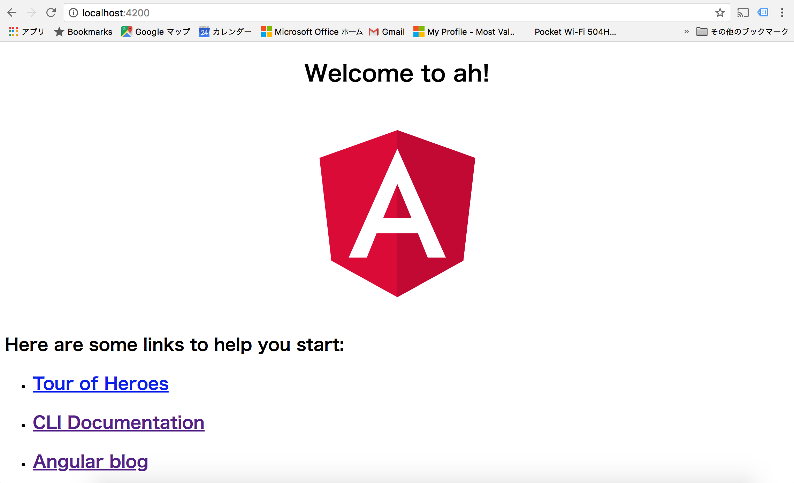

Angular アプリケーションを作成する前に、ウォーミングアップとしてビルトインディレクティブ（Angular が提供しているディレクティブを指しています）について触れていきます。
前章で作成した Handson アプリケーション に対して `ng serve` コマンドを実行しアプリケーションを起動します。



### ngModel

まず __app.module.ts__ に __FormsModule__ を追加します

```
import { BrowserModule } from '@angular/platform-browser';
import { NgModule } from '@angular/core';
import { FormsModule }   from '@angular/forms';

import { AppRoutingModule } from './app-routing.module';

import { AppComponent } from './app.component';


@NgModule({
  declarations: [
    AppComponent
  ],
  imports: [
    BrowserModule,
    AppRoutingModule,
    FormsModule
  ],
  providers: [],
  bootstrap: [AppComponent]
})
export class AppModule { }
```

__app.component.html__ を次のように書き換えます。ブラウザにテキストボックスが表示され入力すると即座に入力した値が表示されると思います。Angular の特徴であるバインディングを利用しています。

```
<input type="text" [(ngModel)]="hoge">
<span>{{hoge}}</span>
```

### \[value\]

\[value\]を利用しデータバインドしますが、こちらは片方向のバインドです。

```
<input type="text" [(ngModel)]="hoge">
<input [value]="hoge">
```

### ngIf

もう少しプログラムチックな動きをさせるために ngIf を利用してみます。テキストボックスに入力した値が 1 のときにメッセージを出力するというロジックを記述してみます。

```
<input type="text" [(ngModel)]="hoge">
<span *ngIf="hoge==='1'">1が入力されました<span>
```

### ng-invalid と ng-dirty

テキストボックスに対して必須チェックを実装することが可能です。先ほどのサンプルはテキストボックスに required を入れることでその項目が必須項目となります。

```
<input type="text" [(ngModel)]="hoge" required>
<span *ngIf="hoge==='1'">1が入力されました<span>
```

画面上、警告も何も表示されないので何が起きているのか確認できませんが、カスケードスタイルシートを定義するとよく理解できます。__app.component.css__ を次のように記載してください。

```
input.ng-invalid {
  border-color: #ff0000;
}
```

何も入力されていないときにはテキストボックスの縁が赤くなっていることが確認できます。ただ、これだと入力前から赤いので UI としてはイマイチといった感じなので、ここで ng-dirty を利用します。カスケードスタイルシートを次のように変更してください。

```
input.ng-invalid.ng-dirty {
  border-color: #ff0000;
}
```

こうすることで入力前は警告なしで、入力後、空欄にした場合は赤くなることが確認できます。

### $invalid と $dirty を利用する

入力されてなかった場合、赤くなりましたがメッセージも表示します。警告メッセージは「必須入力です」にしましょう。__app.component.html__ を次のようにします。

```
<form #f="ngForm" novalidate>
  <input type="text" name="hoge" ngModel required>
  <p [hidden]="!f.form.dirty || f.form.valid">必須入力です</p>
</form>
```

### ngFor

コンストラクタでデータを定義し ngFor で定義したデータを表示します。__app.component.html__ に ngFor 文を追加します。

```
<form #f="ngForm" novalidate>
  <input type="text" name="hoge" ngModel required>
  <p [hidden]="!f.form.dirty || f.form.valid">必須入力です</p>
</form>
<ul>
  <li *ngFor="let data of demoData">{{data.name}} - {{data.age}}</li>
</ul>
```

何かしらの理由があり `ngForOf` を使いたい場合は

```
<form #f="ngForm" novalidate>
  <input type="text" name="hoge" ngModel required>
  <p [hidden]="!f.form.dirty || f.form.valid">必須入力です</p>
</form>
<ul>
  <ng-template ngFor let-data [ngForOf]="demoData">
    <li>{{data.name}} - {{data.age}}</li>
  </ng-template>
</ul>
```

__app.component.ts__ にデータを追加してください。

```
import { Component } from '@angular/core';

@Component({
  selector: 'app-root',
  templateUrl: './app.component.html',
  styleUrls: ['./app.component.css']
})
export class AppComponent {
  title = 'app sample';
  demoData: any = [
    {name: '山田', age: 24},
    {name: '田中', age: 28},
    {name: '佐藤', age: 18},
    {name: '井上', age: 32},
    {name: '高橋', age: 46}
  ]
}
```

ここまでがウォーミングアップです。それではちょっとしたアプリケーションを開発しましょう。
