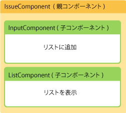
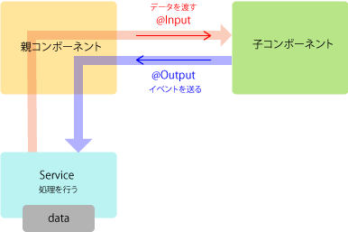

コンポーネント分割することで様々なメリットが現れます。テストが行いやすいというのもそのひとつです。機能的には今までと同じものですが、今回は更新画面も合わせて作ってみます。早速作業しましょう。

### issue.module の追加

まずはじめに issue.module を追加します。モジュールを追加するメリットとしては

* issue 機能がひとまとまりになる
* pages.module の肥大化が防げる

などが上げられます

```
$ ng g module pages/issue
  create src/app/pages/issue/issue.module.ts (189 bytes)
$  
```

__issue.module.ts__ は IssueComponent と IssueService を保持します。 IssueComponent は PagesRouting で利用しますので Exports しておきます。

```
import { NgModule } from '@angular/core';
import { CommonModule } from '@angular/common';
import { FormsModule } from '@angular/forms';

import { IssueComponent } from './issue.component';

import { IssueService } from './issue.service';

@NgModule({
  imports: [
    CommonModule,
    FormsModule
  ],
  exports: [IssueComponent],
  declarations: [IssueComponent],
  providers: [IssueService]
})
export class IssueModule { }
```

IssueModule でドメイン定義しましたので __pages.module.ts__ では IssueModule を呼び出すように変更します。

```
import { NgModule } from '@angular/core';
import { CommonModule } from '@angular/common';
import { FormsModule } from '@angular/forms';

import { PagesRoutingModule } from './pages-routing.module';
import { PagesComponent } from './pages.component';
import { TopComponent } from './top/top.component';
import { IssueModule } from './issue/issue.module';
import { WikiComponent } from './wiki/wiki.component';
import { MarkdownPipe } from './wiki/markdown.pipe';

@NgModule({
  imports: [
    CommonModule,
    FormsModule,
    PagesRoutingModule,
    IssueModule
  ],
  declarations: [PagesComponent, TopComponent, WikiComponent, MarkdownPipe],
})
export class PagesModule { }
```

次に IssueComponent の部品コンポーネントを生成します

```
$ ng g component pages/issue/issue-detail
$ ng g component pages/issue/issue-input
$ ng g component pages/issue/issue-list
$ ng g component pages/issue/issue-update
```

### IssueComponent

はじめに __IssueComponent__ を修正します。IssueComponent は Issue の入力コンポーネントと入力された一覧を表示する部分を表示させるために定義します。

__issue.component.html__ は次のようになります。

```
<h2>Issue</h2>
<ah-issue-input></ah-issue-input>
<ah-issue-list></ah-issue-list>
```

__issue.component.ts__ は特別に処理というものが無いので次のような何も無くなります。

```
import { Component, OnInit } from '@angular/core';

@Component({
  selector: 'ah-issue',
  templateUrl: './issue.component.html',
  styleUrls: ['./issue.component.sass']
})
export class IssueComponent implements OnInit {

  constructor (
  ) {}

  ngOnInit(): void {
  }

}
```

### IssueDetailComponent

__issue-detail.component.html__ は一覧の詳細部分のみを記載します。

```
<div>{{rownum+1}}</div>
<p>{{title}}</p>
<pre>{{desc}}</pre>
<button (click)="onClick($event)">削除</button>
<button (click)="gotoUpdate()">更新</button>
```

__issue-detail.component.ts__ では、@Input により IssueListComponent からデータを取得し、@Output と Emitter を利用しイベントを IssueListComponent へ渡しています。





> IssueList と IssueDetail を親子関係とすると（IssueList は親、IssueDetailは子）、親から子へは @Input を使って直接的にデータを渡すことが出来ます。子から親へは @Output と Emitter を使って直接的にイベントを渡すことが出来ます。
>
> この方法を採用することで Angular はレスポンスを上げる方法のひとつにしています。

```
import { Component, OnInit, Input, Output, EventEmitter } from'@angular/core';
import { Router } from '@angular/router';

@Component({
  selector: 'ah-issue-detail',
  templateUrl: './issue-detail.component.html',
  styleUrls: ['./issue-detail.component.css']
})
export class IssueDetailComponent implements OnInit {

  @Input('rownum')
  rownum: number;

  @Input('title')
  title: string;

  @Input('desc')
  desc: string;

  @Output()
  private onDelete = new EventEmitter();
  public onClick($event: any): void {
    this.onDelete.emit($event);
  }

  public gotoUpdate(): void {
    this.router.navigate(['/pages/issue/update', this.rownum]);
  }

  constructor(
    private router: Router
  ) { }

  ngOnInit() {
  }

}
```

### IssueInputComponent

__issue-input.component.html__ では入力部のみを定義しています。

```
<form #f="ngForm" (ngSubmit)="onSubmit(f)"novalidate>
  <input name="title" ngModel required placeholder="title">
  <textarea name="desc" ngModel required placeholder="desc"></textarea>
  <button type=submit [disabled]="!f.form.valid">登録</button>
</form>
```

__issue-input.component.ts__ では入力された値を IssueService へ登録する部分のみ定義しています。

```
import { Component, OnInit } from'@angular/core';
import { NgForm } from '@angular/forms';

import { IssueService } from '../issue.service';

@Component({
  selector: 'ah-issue-input',
  templateUrl: './issue-input.component.html',
  styleUrls: ['./issue-input.component.css']
})
export class IssueInputComponent implements OnInit {

  constructor(
    private issueService: IssueService
  ) {
  }

  ngOnInit() {
  }

  public onSubmit(form: NgForm): void {

    const issue = {
      title: form.value.title,
      desc: form.value.desc
    };

    this.issueService.add(issue);

    form.reset();
  }

}
```

### IssueListComponent

__issue-list.component.html__ では Issue 登録された情報を一覧化し詳細については IssueDetail へ渡しています。

```
<div *ngFor="let issue of issues; let i = index">
  <ah-issue-detail
    [rownum]="i"
    [title]="issue.title"
    [desc]="issue.desc"
    (onDelete)="onDelete(i)">
  </ah-issue-detail>
</div>
```

__issue-list.component.ts__ では IssueService からデータを取得し、データを削除する部分を記載しています。

```
import { Component, OnInit } from'@angular/core';

import { Issue } from'../issue';
import { IssueService } from'../issue.service';

@Component({
  selector: 'ah-issue-list',
  templateUrl: './issue-list.component.html',
  styleUrls: ['./issue-list.component.css']
})
export class IssueListComponent implements OnInit {

  issues: Issue[];

  constructor (
    private issueService: IssueService
  ) {}

  public ngOnInit () {
    this.issues = this.issueService.list;
  }

  public onDelete(index: number): void {
    this.issueService.delete(index);
  }

}
```

## IssueModule

issue.module.ts も確認します。

```
import { NgModule } from '@angular/core';
import { CommonModule } from '@angular/common';
import { FormsModule }   from '@angular/forms';

import { IssueComponent } from './issue.component';

import { IssueService } from './issue.service';
import { IssueDetailComponent } from './issue-detail/issue-detail.component';
import { IssueInputComponent } from './issue-input/issue-input.component';
import { IssueListComponent } from './issue-list/issue-list.component';

@NgModule({
  imports: [
    CommonModule,
    FormsModule
  ],
  exports: [IssueComponent],
  declarations: [IssueComponent, IssueDetailComponent, IssueInputComponent, IssueListComponent],
  providers: [IssueService]
})
export class IssueModule { }
```

> IssueModule で IssueService を宣言するという意味はスコープ定義も行っているということです。プロバイダーとして宣言された IssueService は IssueModule 内で共有して利用できるリソースだという意味です。
