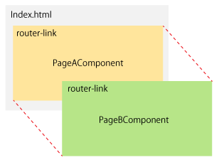
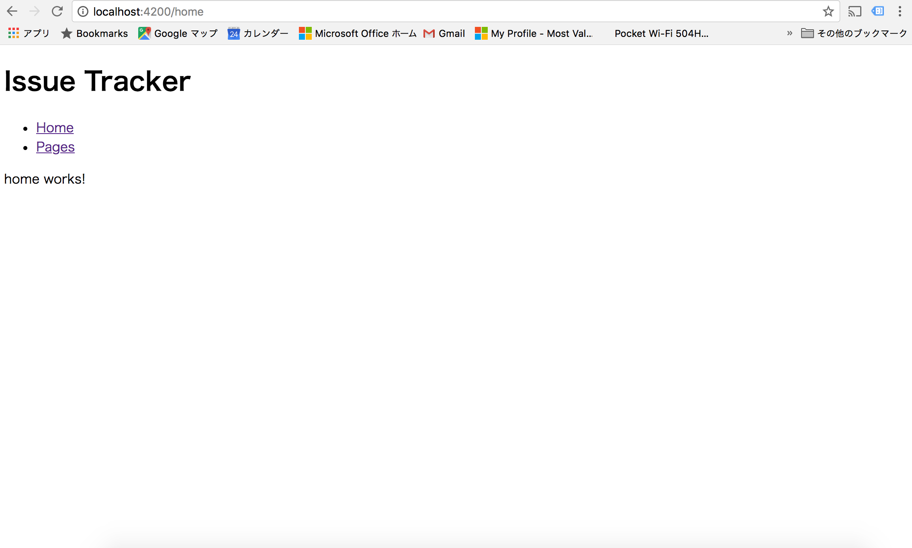
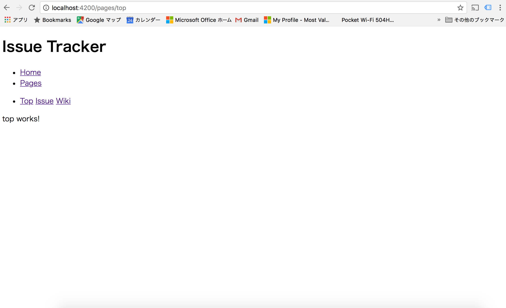

SPA\(Single-page Application\) の最大の特徴であるルーティングについて学びます。SPAのルーティングはURLに紐付いた画面を表示させる仕組みです。

> SPA は以前のWebアプリケーションと比べ、レスポンスが高速でUI/UXに優れています。

## ページの作成とルーティングの設定

はじめにルーティングに必要となるいくつかの画面を追加します。top 画面、issue 画面、wiki 画面は pages 配下として定義しています。

```
$ ng g component home
$ ng g component pageNotFound
$ ng g module pages --routing
$ ng g component pages
$ ng g component pages/top
$ ng g component pages/issue
$ ng g component pages/wiki
```



`ng g component` コマンドを実行すると4つのファイルが出来上がり、ひとつのファイルが更新されます。

### home コンポーネントの作成

このコンポーネントはサイトに最初に訪れたときに表示されるコンポーネントです。

```
$ ng g component home
  create src/app/home/home.component.sass (0 bytes)
  create src/app/home/home.component.html (23 bytes)
  create src/app/home/home.component.spec.ts (614 bytes)
  create src/app/home/home.component.ts (261 bytes)
  update src/app/app.module.ts (534 bytes)
$
```

です。__home.component.sass__ は `HomeComponent` に対するSASS定義を記述するものです。__home.component.html__ は、HTMLテンプレートを記述するものです。`spec.ts` という拡張子のものがありますが、これはユニットテストを定義するものです。 __home.component.ts__ は、TypeScriptで何かしらUIに関連する処理を記述するものです。

> よく講演でコンポーネントの話をしますが、Webアプリケーション開発におけるコンポーネントは Web Components をベースにした考え方です。Web Components には次の4つの定義があります。より詳細な説明は [MDN の Web Components](https://developer.mozilla.org/ja/docs/Web/Web_Components) を参照下さい
>
> 1. Custom Element
>
> 2. HTML Templates
>
> 3. HTML Imports
>
> 4. Shadow DOM
>
> Angular は、この Web Component に準じた構成を取っています。具体的には @Component の selector で宣言しているのが Custom Element です。templateUrl で HTML Templates と HTML Imports を実現させています。
>
> Shadow DOM ですが Angular では Scoped CSS を実装し実現させています。ブラウザを開きデベロッパーツールを開いて確認すると CSS が Scoped されているのが解ります。
>
> 各ブラウザの Shadow DOM 実装はばらつきがありますが Angular ではキーワード  `ViewEncapsulation.Native` をコンポーネントに定義することで Showdow DOM を有効にすることができます。Scoped CSS 同様デベロッパーツールを開き確認すると良いでしょう。
>
> ```
> import { Component, ViewEncapsulation } from '@angular/core';
>
> @Component({
>   selector: 'app-root',
>   templateUrl: './app.component.html',
>   styleUrls: ['./app.component.scss'],
>   encapsulation: ViewEncapsulation.Native
> })
> export class AppComponent {
>   title = 'app';
> }
> ```

__app.module.ts__ が更新されているので内容を見てみます

```
import { BrowserModule } from '@angular/platform-browser';
import { NgModule } from '@angular/core';
import { FormsModule }   from '@angular/forms';

import { AppRoutingModule } from './app-routing.module';

import { AppComponent } from './app.component';
import { HomeComponent } from './home/home.component';


@NgModule({
  declarations: [
    AppComponent,
    HomeComponent
  ],
  imports: [
    BrowserModule,
    AppRoutingModule,
    FormsModule
  ],
  providers: [],
  bootstrap: [AppComponent]
})
export class AppModule { }
```

HomeComponent の定義が自動的に挿入されています。この定義を削除する場合ですが、自動的には行いませんので手動にて行う必要があります。

### pageNotFoundコンポーネントの作成

同様に、pageNotFoundコンポーネントを作成します。このコンポーネントは該当するURLが無い場合に表示するコンポーネントです。

```
$ ng g component pageNotFound
  create src/app/page-not-found/page-not-found.component.sass (0 bytes)
  create src/app/page-not-found/page-not-found.component.html (33 bytes)
  create src/app/page-not-found/page-not-found.component.spec.ts (672 bytes)
  create src/app/page-not-found/page-not-found.component.ts (299 bytes)
  update src/app/app.module.ts (644 bytes)
$
```

先ほどと同様に `app.module.ts` が更新されてますので内容を各自確認してください。

### pagesコンポーネントの作成

pages コンポーネントはアプリケーション郡を登録するコンポーネントです。pages コンポーネントは「郡」という表現を使っている通り「一つのまとまり」を示しています。それを Angular では module というものを使って表現します。このモジュールは pages の中でも幾つかのページが存在するため app-route とは別のルーティング機能を持たせるように定義します。

```
$ ng g module pages --routing
  create src/app/pages/pages-routing.module.ts (248 bytes)
  create src/app/pages/pages.module.ts (275 bytes)
$ 
```

これに pagesコンポーネントを追加します。

```
$ ng g component pages
  create src/app/pages/pages.component.sass (0 bytes)
  create src/app/pages/pages.component.html (24 bytes)
  create src/app/pages/pages.component.spec.ts (621 bytes)
  create src/app/pages/pages.component.ts (265 bytes)
  update src/app/pages/pages.module.ts (341 bytes)
$ 
```

先程の Homeコンポーネントとの違いは登録される module が異なるという点です。pages.module を見てみましょう

```
import { NgModule } from '@angular/core';
import { CommonModule } from '@angular/common';

import { PagesRoutingModule } from './pages-routing.module';
import { PagesComponent } from './pages.component';

@NgModule({
  imports: [
    CommonModule,
    PagesRoutingModule
  ],
  declarations: [PagesComponent]
})
export class PagesModule { }
```

### ３つのアプリケーションを登録

アプリケーションのコンポーネント３つを生成します。

```
$ ng g component pages/top
  create src/app/pages/top/top.component.sass (0 bytes)
  create src/app/pages/top/top.component.html (22 bytes)
  create src/app/pages/top/top.component.spec.ts (607 bytes)
  create src/app/pages/top/top.component.ts (257 bytes)
  update src/app/pages/pages.module.ts (407 bytes)
$ ng g component pages/issue
  create src/app/pages/issue/issue.component.sass (0 bytes)
  create src/app/pages/issue/issue.component.html (24 bytes)
  create src/app/pages/issue/issue.component.spec.ts (621 bytes)
  create src/app/pages/issue/issue.component.ts (265 bytes)
  update src/app/pages/pages.module.ts (481 bytes)
y$ ng g component pages/wiki
  create src/app/pages/wiki/wiki.component.sass (0 bytes)
  create src/app/pages/wiki/wiki.component.html (23 bytes)
  create src/app/pages/wiki/wiki.component.spec.ts (614 bytes)
  create src/app/pages/wiki/wiki.component.ts (261 bytes)
  update src/app/pages/pages.module.ts (551 bytes)
$ 
```

各コンポーネントが生成され pages.module に登録されています。

```
import { NgModule } from '@angular/core';
import { CommonModule } from '@angular/common';

import { PagesRoutingModule } from './pages-routing.module';
import { PagesComponent } from './pages.component';
import { TopComponent } from './top/top.component';
import { IssueComponent } from './issue/issue.component';
import { WikiComponent } from './wiki/wiki.component';

@NgModule({
  imports: [
    CommonModule,
    PagesRoutingModule
  ],
  declarations: [PagesComponent, TopComponent, IssueComponent, WikiComponent]
})
export class PagesModule { }
```

### ルーティングの設定

ルーティング設定用のモジュールを作成します。`app-routing.module.ts` は

```
import { NgModule } from '@angular/core';
import { Routes, RouterModule } from '@angular/router';

const routes: Routes = [];

@NgModule({
  imports: [RouterModule.forRoot(routes)],
  exports: [RouterModule]
})
export class AppRoutingModule { }
```

という定義が既に記載されています。ここに HomeコンポーネントとPageNotFoundコンポーネント、PagesModuleの定義を記載します。PagesModuleは「郡」を呼び出すため記載方法がHomeコンポーネントとPageNotFoundコンポーネントとは異なります。

```
import { NgModule } from '@angular/core';
import { Routes, RouterModule } from '@angular/router';

import { HomeComponent } from './home/home.component';
import { PageNotFoundComponent } from './page-not-found/page-not-found.component';

const routes: Routes = [
  { path: '', redirectTo: 'home', pathMatch: 'full'},
  { path: 'home', component: HomeComponent },
  { path: 'pages', loadChildren: './pages/pages.module#PagesModule' },
  { path: '**', component: PageNotFoundComponent }
];

@NgModule({
  imports: [RouterModule.forRoot(routes)],
  exports: [RouterModule]
})
export class AppRoutingModule { }
```
> プロジェクト生成時に `--routing` パラメーターを指定してない場合には `app-routing.module.ts`  が作られません。

ここで、`path: ''` はルートパス（ ://localhost:4200/ のような）で呼ばれたときに `/home` へリダイレクトするよう定義しています。リダイレクト先の `/home` ではコンポーネント HomeComponent を実行するよう定義されていますので、画面には HomeComponent で定義されたテンプレートが表示されます。

`path: '**'` は、ルーティング定義に無いパスが指定された場合（例えば、 ://localhost:4200/xxxxx ）にPageNotFoundComponent を表示するよう定義しています。404ページとしての定義です。

続いて、`app.module.ts` は`ng g component`コマンドで必要なファイルが追加されています。確認してください。

今回はルーティングの設定がありますのでルーティングをプロバイダー登録します。結果として次のようになります

```
import { BrowserModule } from '@angular/platform-browser';
import { NgModule } from '@angular/core';

import { AppRoutingModule } from './app-routing.module';
import { AppComponent } from './app.component';
import { HomeComponent } from './home/home.component';
import { PageNotFoundComponent } from './page-not-found/page-not-found.component';

@NgModule({
  declarations: [
    AppComponent,
    HomeComponent,
    PageNotFoundComponent
  ],
  imports: [
    BrowserModule,
    AppRoutingModule
  ],
  providers: [],
  bootstrap: [AppComponent]
})
export class AppModule { }
```

`app.component.html`に aタグ を使って使って簡易メニューを作成します。

```
<h1>Issue Tracker</h1>
<ul>
  <li><a routerLink="home">Home</a></li>
  <li><a routerLink="pages">Pages</a></li>
</ul>
<router-outlet></router-outlet>
```



## pages ルーティングの設定

pages 配下にあるページに対するルーティング設定を行います。`pages-routing.module.ts` は

```
import { NgModule } from '@angular/core';
import { Routes, RouterModule } from '@angular/router';

const routes: Routes = [];

@NgModule({
  imports: [RouterModule.forChild(routes)],
  exports: [RouterModule]
})
export class PagesRoutingModule { }
```

これに３つのアプリケーションを登録します

```
import { NgModule } from '@angular/core';
import { Routes, RouterModule } from '@angular/router';

import { PagesComponent } from './pages.component';
import { TopComponent } from './top/top.component';
import { IssueComponent } from './issue/issue.component';
import { WikiComponent } from './wiki/wiki.component';

const routes: Routes = [
  {
    path: '',
    component: PagesComponent,
    children: [
      { path: '', redirectTo: 'top', pathMatch: 'full'},
      { path: 'top', component: TopComponent },
      { path: 'issue', component: IssueComponent },
      { path: 'wiki', component: WikiComponent }
    ]
  }
];

@NgModule({
  imports: [RouterModule.forChild(routes)],
  exports: [RouterModule]
})
export class PagesRoutingModule { }
```

__pages.module.ts__ は自動的に登録されていて次のように定義されてます。

```
import { NgModule } from '@angular/core';
import { CommonModule } from '@angular/common';

import { PagesRoutingModule } from './pages-routing.module';
import { PagesComponent } from './pages.component';
import { TopComponent } from './top/top.component';
import { IssueComponent } from './issue/issue.component';
import { WikiComponent } from './wiki/wiki.component';

@NgModule({
  imports: [
    CommonModule,
    PagesRoutingModule
  ],
  declarations: [PagesComponent, TopComponent, IssueComponent, WikiComponent]
})
export class PagesModule { }
```

最後に、`pages.component.html`に aタグ を使って使って簡易メニューを作成します。

```
<ul>
  <li>
    <a routerLink="top">Top</a>
    <a routerLink="issue">Issue</a>
    <a routerLink="wiki">Wiki</a>
  </li>
</ul>
<router-outlet></router-outlet>
```

これでルーティングを定義することができました。実際に画面を動かしルーティングが出来ているか確認してください。



参考までに、ここまでの `Handon/src/app` 内のファイル構成を記載します。

```
$ tree
.
├── app-routing.module.ts
├── app.component.html
├── app.component.sass
├── app.component.spec.ts
├── app.component.ts
├── app.module.ts
├── home
│   ├── home.component.html
│   ├── home.component.sass
│   ├── home.component.spec.ts
│   └── home.component.ts
├── page-not-found
│   ├── page-not-found.component.html
│   ├── page-not-found.component.sass
│   ├── page-not-found.component.spec.ts
│   └── page-not-found.component.ts
└── pages
    ├── issue
    │   ├── issue.component.html
    │   ├── issue.component.sass
    │   ├── issue.component.spec.ts
    │   └── issue.component.ts
    ├── pages-routing.module.ts
    ├── pages.component.html
    ├── pages.component.sass
    ├── pages.component.spec.ts
    ├── pages.component.ts
    ├── pages.module.ts
    ├── top
    │   ├── top.component.html
    │   ├── top.component.sass
    │   ├── top.component.spec.ts
    │   └── top.component.ts
    └── wiki
        ├── wiki.component.html
        ├── wiki.component.sass
        ├── wiki.component.spec.ts
        └── wiki.component.ts

6 directories, 32 files
$ 
```

ここまでの作業は非常に簡単だったと思います。特に angular-cli のお陰で、ややこしい環境設定は気にする必要無いというのは大きなメリットだと思います。
